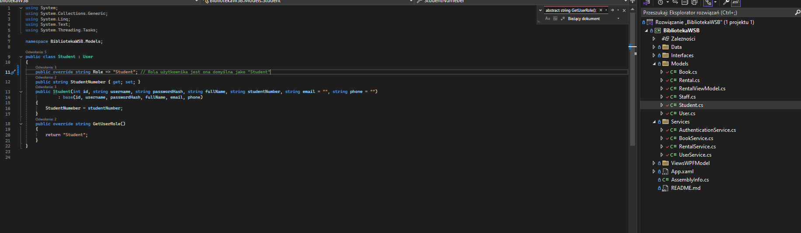
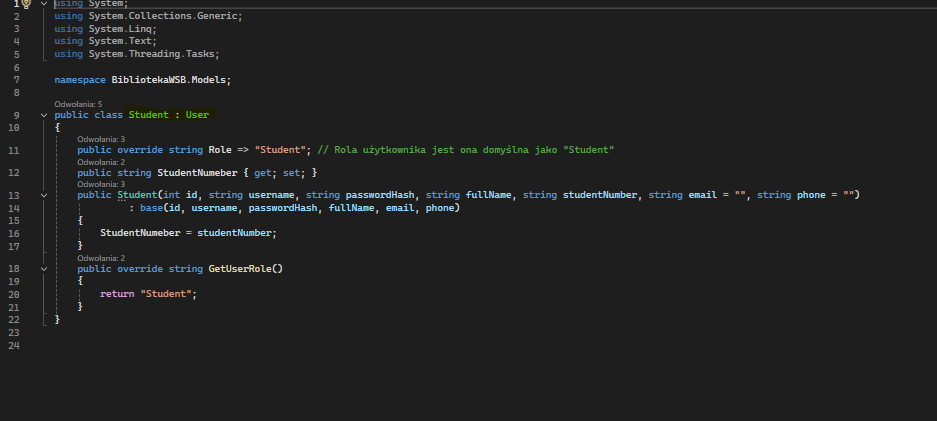
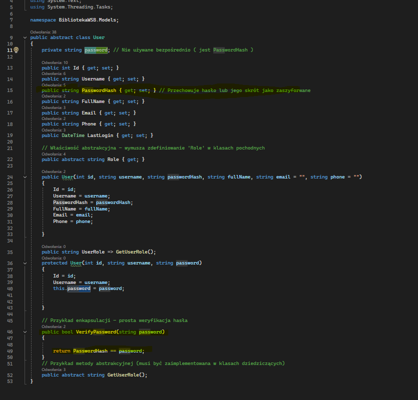
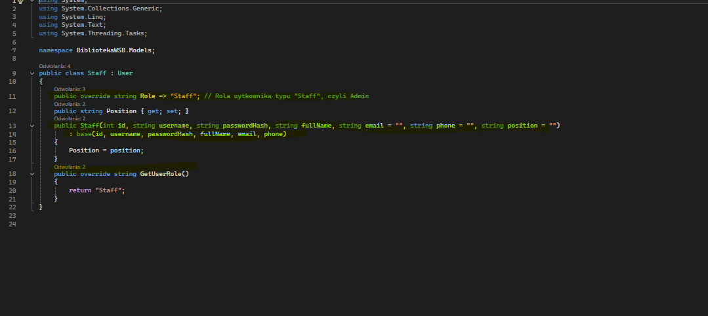
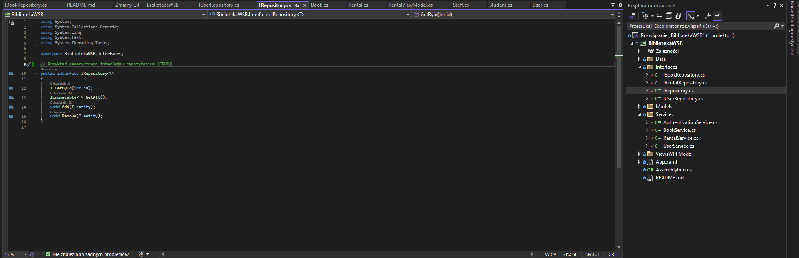
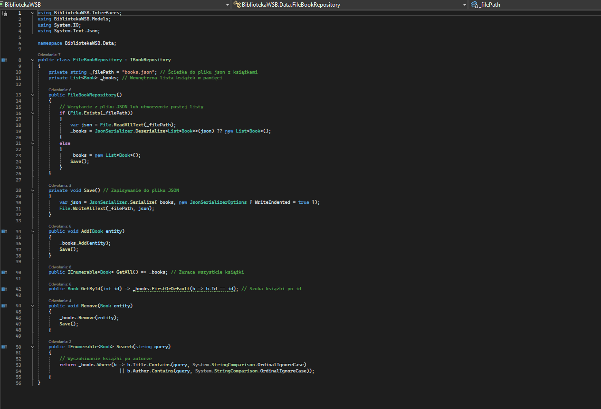
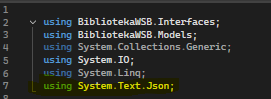
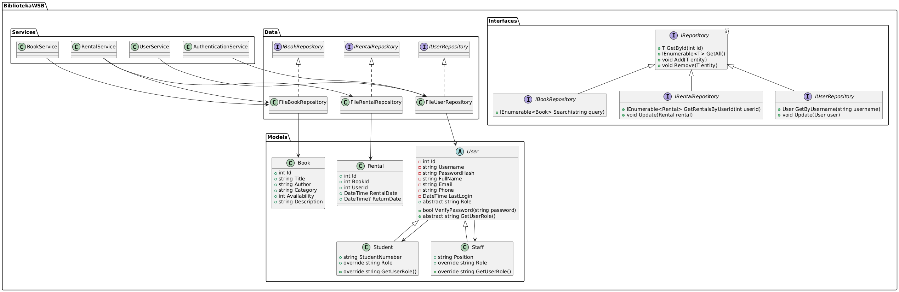

# Biblioteka WSB

Projekt **Biblioteka WSB** to prosta aplikacja desktopowa (WPF) realizująca podstawowe funkcje systemu bibliotecznego, tj. zarządzanie użytkownikami, książkami oraz wypożyczeniami.

---

## Spis treści

1. [Wymagania](#wymagania)
2. [Dane do logowania - Administrator](#dane-do-logowania---administrator)
3. [Struktura projektu](#struktura-projektu)
4. [Cel biznesowy aplikacji](#cel-biznesowy-aplikacji)
5. [Opis działania](#opis-działania)
6. [Opis architektury](#opis-architektury)
7. [Uruchomienie aplikacji](#uruchomienie-aplikacji)  
8. [Główne funkcjonalności](#główne-funkcjonalności)  
9. [Pliki konfiguracyjne i baza danych (pliki JSON)](#pliki-konfiguracyjne-i-baza-danych-pliki-json)  
10. [Nowości](#nowości)  
11. [Rozbudowa aplikacji](#rozbudowa-aplikacji)
12. [Braki w aplikacji](#braki-w-aplikacji)
13. [Diagram klas UML](#diagram-klas-uml)
10. [Autorzy](#autorzy)  

---

## Wymagania

- **.NET 8.0 lub nowszy** – projekt napisany w C# z wykorzystaniem WPF i serializacji JSON.
- **Microsoft Visual Studio 2022** (lub inny kompatybilny IDE).
- System **Windows** 
- Opcjonalnie: znajomość mechanizmu serializacji wbudowanego w **System.Text.Json**.

---

## Dane do logowania - Administrator

**Domyślne dane logowania do konta administratora:**

- **Login**: `anna.nowak`  
- **Hasło**: `admin123`  

Te dane umożliwiają logowanie do konta administratora i dostęp do zaawansowanych funkcjonalności, takich jak zarządzanie użytkownikami, książkami oraz wypożyczeniami w panelu pracownika.

---
## Struktura projektu

1. **Data** – Repozytoria zapisujące dane w plikach JSON.
2. **Interfaces** – Definicje interfejsów (m.in. `IRepository<T>`).
3. **Models** – Klasy reprezentujące encje (Książka, Użytkownik, Wypożyczenie itp.).
4. **Services** – Logika biznesowa (m.in. `AuthenticationService`, `BookService`, `RentalService`).
5. **ViewsWPFModel** – Warstwa prezentacji WPF (okna `*.xaml` i obsługa zdarzeń w `.cs`), w tym:
   - **AddBookWindow.xaml** – Okno dodawania nowej książki do biblioteki.
   - **StaffPanelWindow.xaml** – Panel pracownika umożliwiający zarządzanie książkami i wypożyczeniami.

---
## Cel bizenesowy aplikacji
**Głównym celem aplikacji jest usprawnienie obiegu książek w bibliotece.**
**Dzięki aplikacji można:**
1. Przeglądać listę książek i ich szczegóły
2. Wyszukiwać tytuły/autorów
3. Wypożyczać i zwracać książki
4. Zarządzać kontami czytelników i pracowników biblioteki
5. Przeglądać historię wypożyczeń dla danego użytkownika,
6. Dodawać oraz usuwać książki (opcja dla pracowników)

## Opis działania

1. **Logowanie**  
   - Okno `LoginWindow` pobiera od użytkownika login i hasło.  
   - Klasa `AuthenticationService` sprawdza poprawność danych w pliku `users.json` (poprzez `FileUserRepository`).
   - Jeśli dane są prawidłowe, otwiera się główne okno (`MainWindow`).
   - Użytkownicy z uprawnieniami pracownika mają dostęp do panelu pracownika (`StaffPanelWindow`).

2. **Rejestracja**  
   - W `RegisterWindow` użytkownik podaje podstawowe dane.  
   - System sprawdza, czy nazwa użytkownika już istnieje.  
   - Tworzony jest obiekt `Student` (domyślny typ) i zapisywany w `users.json`.

3. **Zarządzanie książkami**  
   - Dane książek są w `books.json`.  
   - W `BookSearchView` można je przeszukiwać i wypożyczać.
   - **Nowość**: Pracownicy mogą dodawać nowe książki przez `AddBookWindow`.

4. **Panel pracownika**  
   - `StaffPanelWindow` umożliwia pracownikom zarządzanie książkami i wypożyczeniami.
   - Funkcjonalności:
     - **Dodawanie książek** (`AddBookWindow`).
     - **Usuwanie książek**.
     - **Przegląd wszystkich wypożyczeń**.

5. **Wypożyczanie**  
   - Przy każdym wypożyczeniu aktualizowany jest stan dostępności w `Book`.  
   - Tworzony jest wpis w `rentals.json` (klasa `Rental`).

6. **Zwrot**  
   - Widok `RentalHistoryView` pozwala oznaczyć książkę jako zwróconą (`ReturnDate != null`).  
   - Dostępność książki w repozytorium (`books.json`) zwiększa się o 1.

7. **Moje konto**  
   - Okno `MyAccountView` pokazuje dane zalogowanego użytkownika, liczbę aktywnych wypożyczeń i opcje (zmiana hasła / usunięcie konta).

---
## Opis architektury

1. **Warstwa modeli (Models)**  
   - Zawiera klasy reprezentujące encje domenowe: `Book`, `Rental`, `User` (oraz klasy pochodne `Student`, `Staff`).
   - Klasa `User` jest **abstrakcyjna**; `Student` i `Staff` dziedziczą po niej, implementując własne pola (np. `username`,`PasswordHash`) i metody (np.`GetUserRole()`).
   - Zastosowanie dziedziczenia i polimorfizmu pozwala jednorodnie obsługiwać użytkowników, a jednocześnie zróżnicować ich role (Student vs. Staff).
   - Polimorfizm został użyty w klasach `Student` i `Staff` jako `User`
   - Hermetyzacja została użyta w klasie `User` chodzi o szegóły przechowywania hasła (Pole `PasswordHash`) nie są ujawniane poza klasą, a sprawdzenie hasła odbywa się w           metodzie `VerifyPassword()`
   **Zrzut ekranu 1 - Dziedziczenie** – fragment klasy `Student.cs` (z folderu *Models*):
    
   **Zrzut ekranu 2 - Polimorfirzm**
     
   **Zrzut ekranu 3 - Hermatyzacja**
     
   **Zrzut ekranu 4 - Abstrakcja**
     
2. **Warstwa interfejsów (Interfaces)**  
   - Definiuje kontrakty repozytoriów (m.in. `IRepository<T>`, `IBookRepository`, `IUserRepository`).
   - Ułatwia stosowanie wstrzykiwania zależności i wymianę implementacji warstwy danych (np. pliki JSON można zastąpić bazą SQL).

   **Zrzut ekranu 5** – definicja interfejsu `IRepository<T>`:
   

   *(Opis: Interfejs definiuje metody `GetById`, `GetAll`, `Add` i `Remove` – do implementacji przez konkretne repozytoria.)*
3. **Warstwa danych (Data)**  
   - Konkretnie realizuje zapis i odczyt z plików JSON (`FileBookRepository`, `FileUserRepository`, `FileRentalRepository`).
   - Hermetyzuje szczegóły dotyczące serializacji i obsługi plików.
   - Stosowana biblioteka w klasach `FileBookRepository`, `FileUserRepository`, `FileRentalRepository` to JSON

   **Zrzut ekranu 6** – fragment `FileBookRepository.cs` (metoda `Save()`):
   
   **Zrzut ekranu 7** - używanie biblioteki json
   
   

   *(Opis: Metoda `Save()` serializuje listę książek i zapisuje ją do pliku `books.json`.)*
5. **Warstwa usług (Services)**  
   - Logika biznesowa (np. `AuthenticationService` do weryfikowania użytkowników, `RentalService` do zarządzania wypożyczeniami, `BookService` do obsługi książek).
   - Korzysta z warstwy danych poprzez interfejsy.

   **Zrzut ekranu 8** – fragment `RentalService.cs` (logika wypożyczenia `RentBook`):
   

   *(Opis: Metoda `RentBook` sprawdza `CanRentBook()`, aktualizuje dostępność książki i zapisuje informacje o wypożyczeniu w repozytorium.)*
---
## Uruchomienie aplikacji

1. Sklonuj lub pobierz projekt z repozytorium.
2. Otwórz rozwiązanie w Visual Studio 2022 (lub innym IDE wspierającym .NET 8 i WPF).
3. Upewnij się, że masz włączony tryb **Debug** lub **Release**, a następnie zbuduj projekt (`Ctrl + Shift + B`).
4. Uruchom aplikację (F5 lub przycisk _Start_).

   **Po uruchomieniu** w katalogu roboczym pojawią się pliki:
   - `users.json`
   - `books.json`
   - `rentals.json`  
   Jeśli nie istnieją, zostaną utworzone automatycznie.

---

## Główne funkcjonalności

- **Logowanie** / **Wylogowanie** (okno `LoginWindow`).
- **Rejestracja** użytkownika (domyślnie `Student`).
- **Wyszukiwarka** książek (`BookSearchView`).
- **Wypożyczanie** i **zwrot** książek (`RentalService`).
- **Historia** wypożyczeń (`RentalHistoryView`).
- **Panel pracownika** (`StaffPanelWindow`):
  - **Dodawanie książek** (`AddBookWindow`).
  - **Usuwanie książek**.
  - **Przegląd wszystkich wypożyczeń**.
- **Zmiana hasła** (`ChangePasswordWindow`).
- **Usuwanie konta** w widoku `MyAccountView`.

---

## Pliki konfiguracyjne i baza danych (pliki JSON)

- **`users.json`**:  
  Przechowuje użytkowników z kluczami: `Id`, `Username`, `PasswordHash`, `Role`, `Email`, `Phone` itp.

- **`books.json`**:  
  Książki z polami `Id`, `Title`, `Author`, `Category`, `Availability`, `Description`.

- **`rentals.json`**:  
  Wypożyczenia z `Id`, `BookId`, `UserId`, `RentalDate`, `ReturnDate`.

**Serializacja** opiera się na `System.Text.Json`.  

---

## Nowości

### AddBookWindow i StaffPanelWindow

Dodano nowe widoki:

- **AddBookWindow**  
  Umożliwia pracownikom dodawanie nowych książek do biblioteki. Formularz zawiera pola:
  - **Tytuł**
  - **Autor**
  - **Kategoria**
  - **Ilość** (dostępność)
  - **Opis**

- **StaffPanelWindow**  
  Panel dla pracowników z dostępem do zaawansowanych funkcji:
  - **Dodawanie książek** przez `AddBookWindow`.
  - **Usuwanie książek** z listy dostępnych pozycji.
  - **Przegląd wszystkich wypożyczeń** z możliwością filtrowania i zarządzania.

---

## Rozbudowa aplikacji

- **Nowe widoki**: wystarczy dodać pliki `.xaml` i obsługę w `.cs`.
- **Nowe pola** w modelach: można zaktualizować struktury `Book`, `Rental`, `Student`.
- **Baza SQL**: wystarczy zaimplementować własne repozytoria i zastąpić obecne `FileXRepository`.

---

## Braki w aplikacji
**To czego nie udało mi się wprowadzić i chciałbym w przyszłości rozbudować to min.:**
- **1. Używanie bazy danych SQL**
- **2. Wprowadzenie pełnoprawnego panelu administratora z możliwością nadwania ról nowym pracownikom chodzi mi o `Staff`**
- **3. Wprowadzenie Unity Testów z Mockowaniem, każda aplikacja musi mieć testy, aby wejść na rynek, wiec testy są obowiązkowe**
- **4. Wprowadzenie lepszych zabezpieczeń kodu i optymalizacja na większą ilość platform niżeli tylko na Windows**
- **5. Większa optymalizacja kodu**
   
## Diagram klas UML

---

## Autorzy

- Kod powstał w ramach programowania obiektowego ćwiczenia  
- Autor: **Patryk Mańka**

Dziękujemy za skorzystanie z **Biblioteka WSB**!
